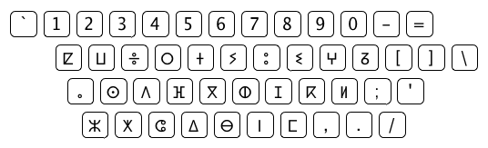
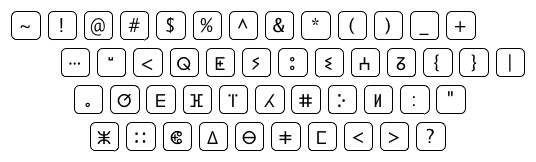

Tifinagh keyboad layout for MacOS X
===================================

# Install
1. Download "Tifinagh.keylayout".
2. Move "Tifinagh.keylayout" into ~/Library/Keyboard\ Layouts/.
3. Add Input Method "Tifinagh (Y.U.U,)" on Preferences.

# Layout
[Normal]

   
[Shift]

   
[Option]

   
[Option Shift]

   
[US Keyboard]

